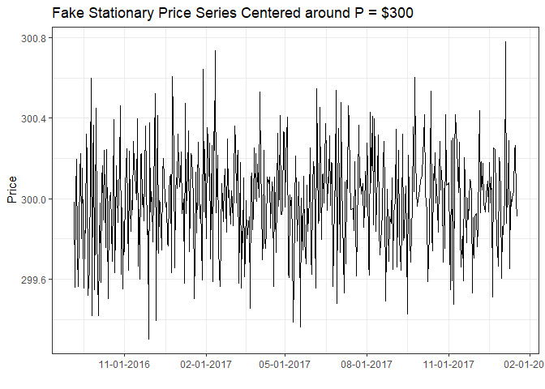
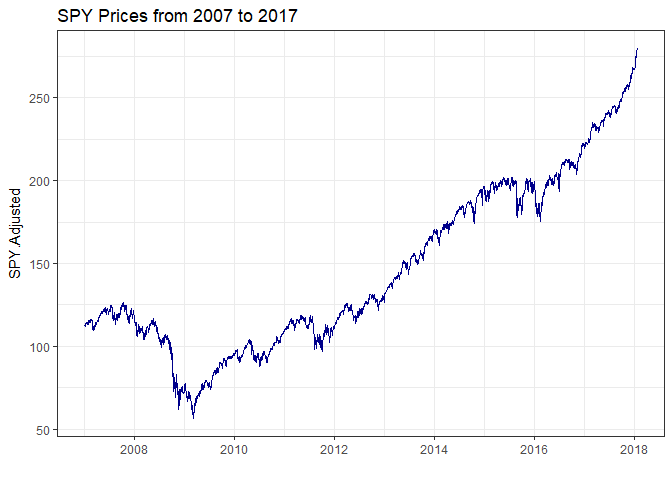

# Basic Time-Series Analysis, Explained


<meta property="og:title" content="Basic Time-Series Analysis, Explained">
<meta property="og:description" content="Even for students who are well trained in econometrics/statistics, getting started with time-series analysis can be mystifying.">

<!-- 
<meta property="og:image" content="">
<meta property="og:url" content="">
-->

Nearly all of my research can be described as applied time-series econometrics. When graduate students approach me hoping to start research in this area, they usually have to start from ground zero in terms of their time-series statistical training. Even incoming graduate students well trained in econometrics often have seen little, if any, treatment of time-series techniques because first and even second econometrics courses focus most of their time on cross-sectional and panel techniques.

For the graduate student aspiring to do a (Ph.D.) dissertation or (M.S.) thesis in price analysis this is a real bummer because it often will be 6 to 18 months before they can work a formal time series econometrics course into their schedule, severely delaying their research unless they can learn a lot on their own. 

This post is for my current and future new-ish graduate students who will soon start a research program in applied price analysis or finance, but feel overwhelmed and under-prepared in the way of time-series econometrics. It is also accessible to anyone who has had a basic class in statistics, and an interest in price analysis or forecasting. I'm not going to cover how to use the actual statistics, I link to resources for how you can start to learn more on your own at the bottom, but in this post I will give a 30,000 ft view of 'The Game' that is going on in applied time-series analysis. It follows a fairly standard template. 

# The Game

When you start a time-series class or read a paper using time-series analyisis for the first time you are greeted by a barage of new statistical tests and terms like, "Augmented Dickey-Fuller Test", "Johansen's Cointegration Test", "AR(p)", "GARCH(p,q)", "Vector Autoregression (VAR)" and "Vector Error Correction Model (VECM)" to name a few. 

Since a statistics or econometrics class has to cover so much... well, statistics, sometimes the forest can be lost for the trees in how all these tests and models can help one build a case around the research question they care about. 

Most introductory time-series econometric statistics and models are utilized toward one of the following three goals: 

+ Stationarity Testing

+ Determining if Variables "Move Together" or are otherwise correlated

+ Adjusting for Residuals that may not be Perfect "White Noise"

Each of these can be thought of as a model selection exercise, helping you to pick witch statistical model is the right choice for your research question. After a while you will have an intuition about which model to use on which kind of data; even then you have to go through this process in every research project to convince your reader that you did, in fact, choose a suitible model for the question at hand. 

If you are new to this you probably don't have any intuition about what the right model is for your question, but going through these three issues will lead you there anyway. 

### Stationarity Testing

The first thing you have to establish in any time-series analysis is whether your data are stationary or not because it essentially determines whether you should try to model levels of the data or first differences of the data. 

If you want to see the R code that generates any of the following stuff, visit [my Github repostory](https://github.com/mindymallory/BlogPosts/blob/master/2018-01-02-Time-Series-Explainer.Rmd) that has the source code for this blog post.  

**Stationary Data**

In the figure below I simulate and plot a stationary series. The series comes from 500 draws of a normal distribution with mean = 300 and standard deviation = 0.25. Notice that it is basically flat, with random ups and downs. 

That is basically what stationarity means, all the data come from a single probability distribution. 

<!-- -->

When you look at this plot it is not hard to imagine that it came from draws from a single probability distribution, namely:

$$p_t \sim N(\mu = 300, \sigma = .25)$$

We need our data to be stationary in order to be able to do statistical tests and modelling on it. So if the data is not stationary, we have to transform it so it is and do our analysis on the transformed variable. The next sub-section should explain why. 

**Non-Stationary or Unit Root Data**

In the plot below I plot the S&P 500 Index from 1990 to 2017. By visual inspection you should have a sense that this series is non-stationary in that the prices appear to be trending. 


<!-- -->


So for example, if you wanted to write down the probability distribution that generate the prices, you would have to know where you are in time. Since the probability distribution that generated the prices keeps changing over time, the distribution is not stationary. This fact will mess up our statistical analysis. 

$$p_t \sim N(\mu_t, \sigma_t)$$

*Spurious Regression*

One of the worst things non-stationary data does is set you up to believe that you have found a really strong relationship between two variables, when you really have just found a 'spurious relationship'. 

<!-- ```{r} -->
<!-- #Not sure why this chunk can run in console, but won't knit. Oh well, saved to .png and embedded that way. -->
<!-- data <- cbind(SPY$SPY.Adjusted, GS$GS.Adjusted) -->
<!-- q <- autoplot(data, facets = FALSE) + -->
<!--   theme_bw() + -->
<!--   labs(title = "SPY and GS Prices from 2007 to 2017", x = "") -->
<!-- ggsave('images/nonstationary.png', width = 6, height = 4) -->
<!-- ``` -->


# Books to Get You Started

Now that you know the game we play in time-series analysis, you might be interested in getting started learning more about how to actually apply these statistics and models to poke around at research ideas. I recommend the following books for self-study. They are both very approachable and hands-on. 

### Enders' Applied Time Series Econometrics

[Walter Enders'](http://time-series.net/) "[Applied Time Series Econometrics](https://www.amazon.com/Applied-Econometric-Wiley-Probability-Statistics/dp/1118808568/ref=dp_ob_title_bk)", is a wonderful book and is basically how I learned to 'do time series' when I was under the gun finishing my own dissertation. 

[](https://www.amazon.com/Applied-Econometric-Wiley-Probability-Statistics/dp/1118808568/ref=dp_ob_title_bk)

### Colonescu's Using R for Principles of Econometrics  

Recently, I found Constantin Colonescu's "Using R for Principles of Econometrics" (for now, a draft is available for free [here](https://bookdown.org/ccolonescu/RPoE4/)). What I really like about this book is that it can be effectively used to both learn applied econometrics and also to learn how to do applied econometrics in R.   

[](http://www.lulu.com/shop/constantin-colonescu/using-r-for-principles-of-econometrics/paperback/product-23467421.html)
