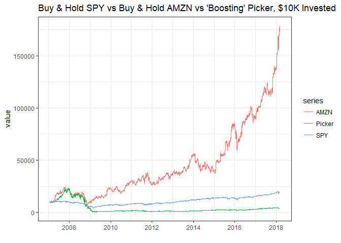
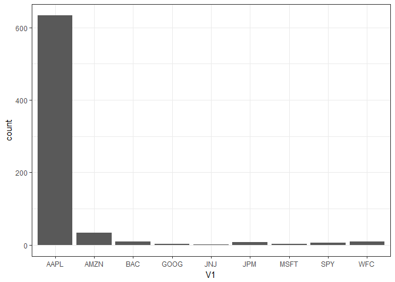

# Machine Learning and Econometrics: Trees, Random Forests, and Boosting


```r
# If you haven't installed any of the packages listed below, do so with the "install.packages('tibble')" command. 
library(tibble)
library(tidyr)
library(ggplot2)
library(knitr)
library(quantmod)
library(randomForest)
library(PerformanceAnalytics)
library(gbm)
library(broom)

#SPY and Top 10 S&P 500 Companies by Market Cap (BRK.B replaced by #11 BAC, bc Berkshire wouldn't download. FB replaced by #12 WFC bc I want long sample and FB has only been trading since '12. Plus 4 of the biggest Spyder sector etfs.) XLF - Financials, XLK - Tech, XLE - Energy, XLY - Consumer Discretionary
SP  <- c("SPY", "AAPL", "MSFT", "AMZN", "WFC", "JPM", "BAC", "JNJ", "GOOG", "XOM", "XLF", "XLK", "XLE", "XLY")
getSymbols(SP)
```

```
##  [1] "SPY"  "AAPL" "MSFT" "AMZN" "WFC"  "JPM"  "BAC"  "JNJ"  "GOOG" "XOM" 
## [11] "XLF"  "XLK"  "XLE"  "XLY"
```

```r
SP <- cbind(SPY$SPY.Adjusted, AAPL$AAPL.Adjusted, MSFT$MSFT.Adjusted, AMZN$AMZN.Adjusted, WFC$WFC.Adjusted, JPM$JPM.Adjusted, BAC$BAC.Adjusted, JNJ$JNJ.Adjusted, GOOG$GOOG.Adjusted, XOM$XOM.Adjusted, XLF$XLF.Adjusted, XLK$XLK.Adjusted, XLE$XLE.Adjusted, XLY$XLY.Adjusted)
colnames(SP) <- c("SPY", "AAPL", "MSFT", "AMZN", "WFC", "JPM", "BAC", "JNJ", "GOOG", "XOM", "XLF", "XLK", "XLE", "XLY")
```

Calculate returns, create lags, and combine into one object, `SPRet`. 


```r
SPRet <- Return.calculate(SP, method = 'log')
laggs.1 <- apply(SPRet, 2, Lag, 1)
laggs.2 <- apply(SPRet, 2, Lag, 2)
laggs.3 <- apply(SPRet, 2, Lag, 3)
laggs.4 <- apply(SPRet, 2, Lag, 4)
laggs.5 <- apply(SPRet, 2, Lag, 5)
laggs.6 <- apply(SPRet, 2, Lag, 6)
laggs.7 <- apply(SPRet, 2, Lag, 7)
laggs.8 <- apply(SPRet, 2, Lag, 8)
laggs.9 <- apply(SPRet, 2, Lag, 9)
laggs.10 <- apply(SPRet, 2, Lag, 10)
laggs   <- cbind(laggs.1, laggs.2, laggs.3, laggs.4, laggs.5, laggs.6, laggs.7, laggs.8, laggs.9, laggs.10)

SPRet   <- cbind(SPRet, laggs)
NAMES   <- c("SPY", "AAPL", "MSFT", "AMZN", "WFC", "JPM", "BAC", "JNJ", "GOOG", "XOM", "XLF", "XLK", "XLE", "XLY")
# Remove the concurrent returns. 
#SPRet   <- SPRet[, setdiff(colnames(SPRet), c("AAPL", "MSFT", "AMZN", "WFC", "JPM", "BAC", "JNJ", "GOOG", "XOM", "XLF", "XLK", "XLE", "XLY"))]
```

Fit random forest to predict SPY returns. 


```r
#set.seed(15) #GOOD
set.seed(12) #also good 
train         <- sample(12:nrow(SPRet[12:dim(SPRet)[1]]), nrow(SPRet[12:dim(SPRet)[1]])/2)
temp          <- SPRet[train]
ntrees        <- 1000

# SPY
SPRtemp       <- temp[, setdiff(colnames(SPRet), c("AAPL", "MSFT", "AMZN", "WFC", "JPM", "BAC", "JNJ", "GOOG", "XOM", "XLF", "XLK", "XLE", "XLY"))]

boost.SPY     <- gbm(SPY~., data= SPRtemp, distribution = "gaussian", n.trees = ntrees, interaction.depth = 4, shrinkage = .001)
yhat.SPY      <- predict(boost.SPY, newdata = SPRet[-train,], n.trees = ntrees)
SPRtempFull   <- SPRet[, setdiff(colnames(SPRet), c("AAPL", "MSFT", "AMZN", "WFC", "JPM", "BAC", "JNJ", "GOOG", "XOM", "XLF", "XLK", "XLE", "XLY"))]
yhat.SPY      <- predict(boost.SPY, newdata = SPRtempFull, n.trees = ntrees)
indicator.SPY <- apply(as.matrix(Lag(yhat.SPY)[13:length(yhat.SPY)]), 1, function(x) if(x<0) (-1) else 1)


# AAPL
SPRtemp       <- temp[, setdiff(colnames(SPRet), c("SPY", "MSFT", "AMZN", "WFC", "JPM", "BAC", "JNJ", "GOOG", "XOM", "XLF", "XLK", "XLE", "XLY"))]

boost.AAPL     <- gbm(AAPL~., data= SPRtemp, distribution = "gaussian", n.trees = ntrees, interaction.depth = 4, shrinkage = .001)
yhat.AAPL      <- predict(boost.AAPL, newdata = SPRet[-train,], n.trees = ntrees)
SPRtempFull    <- SPRet[, setdiff(colnames(SPRet), c("SPY", "MSFT", "AMZN", "WFC", "JPM", "BAC", "JNJ", "GOOG", "XOM", "XLF", "XLK", "XLE", "XLY"))]
yhat.AAPL      <- predict(boost.AAPL, newdata = SPRtempFull, n.trees = ntrees)
indicator.AAPL <- apply(as.matrix(Lag(yhat.AAPL)[13:length(yhat.AAPL)]), 1, function(x) if(x<0) (-1) else 1)

# MSFT
SPRtemp        <- temp[, setdiff(colnames(SPRet), c("SPY", "AAPL", "AMZN", "WFC", "JPM", "BAC", "JNJ", "GOOG", "XOM", "XLF", "XLK", "XLE", "XLY"))]

boost.MSFT     <- gbm(MSFT~., data= SPRtemp, distribution = "gaussian", n.trees = ntrees, interaction.depth = 4, shrinkage = .001)
yhat.MSFT      <- predict(boost.MSFT, newdata = SPRet[-train,], n.trees = ntrees)
SPRtempFull    <- SPRet[, setdiff(colnames(SPRet), c("SPY", "AAPL", "AMZN", "WFC", "JPM", "BAC", "JNJ", "GOOG", "XOM", "XLF", "XLK", "XLE", "XLY"))]
yhat.MSFT      <- predict(boost.MSFT, newdata = SPRtempFull, n.trees = ntrees)
indicator.MSFT <- apply(as.matrix(Lag(yhat.MSFT)[13:length(yhat.MSFT)]), 1, function(x) if(x<0) (-1) else 1)

# AMZN
SPRtemp        <- temp[, setdiff(colnames(SPRet), c("SPY", "AAPL", "MSFT", "WFC", "JPM", "BAC", "JNJ", "GOOG", "XOM", "XLF", "XLK", "XLE", "XLY"))]

boost.AMZN     <- gbm(AMZN~., data= SPRtemp, distribution = "gaussian", n.trees = ntrees, interaction.depth = 4, shrinkage = .001)
yhat.AMZN      <- predict(boost.AMZN, newdata = SPRet[-train,], n.trees = ntrees)
SPRtempFull    <- SPRet[, setdiff(colnames(SPRet), c("SPY", "AAPL", "MSFT", "WFC", "JPM", "BAC", "JNJ", "GOOG", "XOM", "XLF", "XLK", "XLE", "XLY"))]
yhat.AMZN      <- predict(boost.AMZN, newdata = SPRtempFull, n.trees = ntrees)
indicator.AMZN <- apply(as.matrix(Lag(yhat.AMZN)[13:length(yhat.AMZN)]), 1, function(x) if(x<0) (-1) else 1)

# WFC
SPRtemp        <- temp[, setdiff(colnames(SPRet), c("SPY", "AAPL", "MSFT", "AMZN", "JPM", "BAC", "JNJ", "GOOG", "XOM", "XLF", "XLK", "XLE", "XLY"))]

boost.WFC     <- gbm(WFC~., data= SPRtemp, distribution = "gaussian", n.trees = ntrees, interaction.depth = 4, shrinkage = .001)
yhat.WFC      <- predict(boost.WFC, newdata = SPRet[-train,], n.trees = ntrees)
SPRtempFull    <- SPRet[, setdiff(colnames(SPRet), c("SPY", "AAPL", "MSFT", "AMZN", "JPM", "BAC", "JNJ", "GOOG", "XOM", "XLF", "XLK", "XLE", "XLY"))]
yhat.WFC      <- predict(boost.WFC, newdata = SPRtempFull, n.trees = ntrees)
indicator.WFC <- apply(as.matrix(Lag(yhat.WFC)[13:length(yhat.WFC)]), 1, function(x) if(x<0) (-1) else 1)

# JPM
SPRtemp        <- temp[, setdiff(colnames(SPRet), c("SPY", "AAPL", "MSFT", "AMZN", "WFC", "BAC", "JNJ", "GOOG", "XOM", "XLF", "XLK", "XLE", "XLY"))]

boost.JPM     <- gbm(JPM~., data= SPRtemp, distribution = "gaussian", n.trees = ntrees, interaction.depth = 4, shrinkage = .001)
yhat.JPM      <- predict(boost.JPM, newdata = SPRet[-train,], n.trees = ntrees)
SPRtempFull    <- SPRet[, setdiff(colnames(SPRet), c("SPY", "AAPL", "MSFT", "AMZN", "WFC", "BAC", "JNJ", "GOOG", "XOM", "XLF", "XLK", "XLE", "XLY"))]
yhat.JPM      <- predict(boost.JPM, newdata = SPRtempFull, n.trees = ntrees)
indicator.JPM <- apply(as.matrix(Lag(yhat.JPM)[13:length(yhat.JPM)]), 1, function(x) if(x<0) (-1) else 1)

# BAC
SPRtemp        <- temp[, setdiff(colnames(SPRet), c("SPY", "AAPL", "MSFT", "AMZN", "WFC", "JPM", "JNJ", "GOOG", "XOM", "XLF", "XLK", "XLE", "XLY"))]

boost.BAC     <- gbm(BAC~., data= SPRtemp, distribution = "gaussian", n.trees = ntrees, interaction.depth = 4, shrinkage = .001)
yhat.BAC      <- predict(boost.BAC, newdata = SPRet[-train,], n.trees = ntrees)
SPRtempFull    <- SPRet[, setdiff(colnames(SPRet), c("SPY", "AAPL", "MSFT", "AMZN", "WFC", "JPM", "JNJ", "GOOG", "XOM", "XLF", "XLK", "XLE", "XLY"))]
yhat.BAC      <- predict(boost.BAC, newdata = SPRtempFull, n.trees = ntrees)
indicator.BAC <- apply(as.matrix(Lag(yhat.BAC)[13:length(yhat.BAC)]), 1, function(x) if(x<0) (-1) else 1)

# JNJ
SPRtemp        <- temp[, setdiff(colnames(SPRet), c("SPY", "AAPL", "MSFT", "AMZN", "WFC", "JPM", "BAC", "GOOG", "XOM", "XLF", "XLK", "XLE", "XLY"))]

boost.JNJ     <- gbm(JNJ~., data= SPRtemp, distribution = "gaussian", n.trees = ntrees, interaction.depth = 4, shrinkage = .001)
yhat.JNJ      <- predict(boost.JNJ, newdata = SPRet[-train,], n.trees = ntrees)
SPRtempFull    <- SPRet[, setdiff(colnames(SPRet), c("SPY", "AAPL", "MSFT", "AMZN", "WFC", "JPM", "BAC", "GOOG", "XOM", "XLF", "XLK", "XLE", "XLY"))]
yhat.JNJ      <- predict(boost.JNJ, newdata = SPRtempFull, n.trees = ntrees)
indicator.JNJ <- apply(as.matrix(Lag(yhat.JNJ)[13:length(yhat.JNJ)]), 1, function(x) if(x<0) (-1) else 1)

# GOOG
SPRtemp        <- temp[, setdiff(colnames(SPRet), c("SPY", "AAPL", "MSFT", "AMZN", "WFC", "JPM", "BAC", "JNJ", "XOM", "XLF", "XLK", "XLE", "XLY"))]

boost.GOOG     <- gbm(GOOG~., data= SPRtemp, distribution = "gaussian", n.trees = ntrees, interaction.depth = 4, shrinkage = .001)
yhat.GOOG      <- predict(boost.GOOG, newdata = SPRet[-train,], n.trees = ntrees)
SPRtempFull    <- SPRet[, setdiff(colnames(SPRet), c("SPY", "AAPL", "MSFT", "AMZN", "WFC", "JPM", "BAC", "JNJ", "XOM", "XLF", "XLK", "XLE", "XLY"))]
yhat.GOOG      <- predict(boost.GOOG, newdata = SPRtempFull, n.trees = ntrees)
indicator.GOOG <- apply(as.matrix(Lag(yhat.GOOG)[13:length(yhat.GOOG)]), 1, function(x) if(x<0) (-1) else 1)


# Picking Stock with highest absolute value of predicted return. 
all            <- as.data.frame(cbind(yhat.SPY, yhat.AAPL, yhat.AMZN, yhat.MSFT, yhat.WFC, yhat.JPM, yhat.BAC, yhat.JNJ, yhat.GOOG))[13:length(yhat.AMZN),]

colnames(all)  <- c("SPY", "AAPL", "AMZN", "MSFT", "WFC", "JPM", "BAC", "JNJ", "GOOG")

Temp           <- apply(abs(all), 1, which.max)
return.picker  <- data.frame()
for (i in 1:length(Temp)){
return.picker[i,1] <- all[i, Temp[i]]
}

# Long or Short
indicator.picker <- apply(return.picker, 1, function(x) if(x<0) (-1) else 1)

# Actual Returns of Picked Stocks
return.Picker1  <- data.frame(stringsAsFactors = FALSE)
return.Picker2  <- data.frame(stringsAsFactors = FALSE)
return.Picker3  <- data.frame(stringsAsFactors = FALSE)

for (i in 1:length(Temp)){
return.Picker1[i, 1] <- SPRet[i+12, Temp[i]]
return.Picker2[i, 1] <- colnames(all)[Temp[i]]
return.Picker3[i, 1] <- indicator.picker[i]
}
return.Picker1    <- xts(return.Picker1 , order.by = index(SPRtempFull["2007-01-22/"]))
return.Picker2    <- xts(return.Picker2 , order.by = index(SPRtempFull["2007-01-22/"]))
return.Picker3    <- xts(return.Picker3 , order.by = index(SPRtempFull["2007-01-22/"]))
```

Backtesting


```r
invest         <- 10000

DATA            <- cbind(invest*cumprod(1+SPRet$SPY[13:dim(SPRet)[1]]), invest*cumprod(1+return.Picker1), invest*cumprod(1+SPRet$AMZN[13:dim(SPRet)[1]]))
colnames(DATA)  <- c('SPY', "Picker", "AMZN") 

DATA            <- tidy(DATA)
```


```r
ggplot(DATA, aes(x = index, y = value, color = series)) + 
  geom_line() + 
  theme_bw() +
  labs(title = "Buy & Hold SPY vs Buy & Hold AMZN vs 'Boosting' Picker, $10K Invested", x = "")
```

<!-- -->


```r
ggplot(return.Picker2, aes(x = V1)) + geom_bar() + theme_bw()
```

<!-- -->


```r
ggplot(return.Picker3, aes(x = V1)) + geom_bar() + theme_bw()
```

<!-- -->


