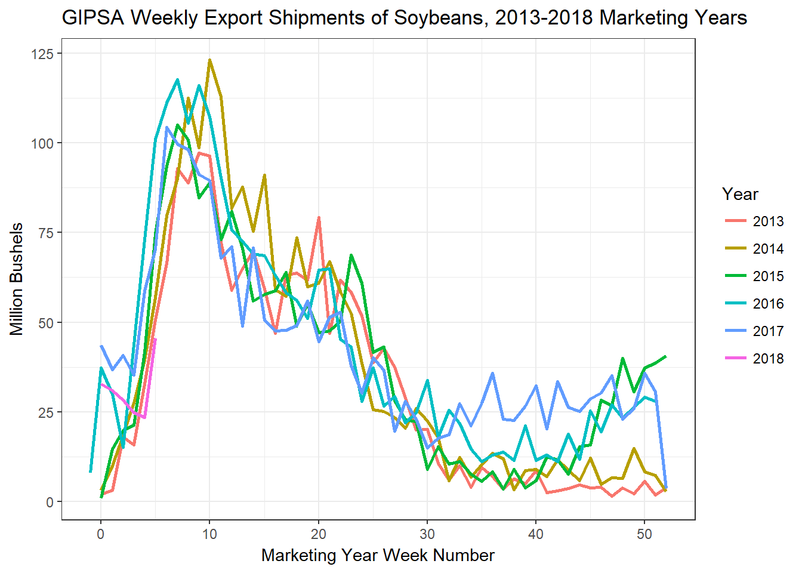

# Weekly Exports of Corn, Soybeans, and Wheat during the 2018 Trade War with China?!?


Get the data from USDA FGIS.

```r
library(tidyverse)

DATA_2018 <- read.csv(file = "https://fgisonline.ams.usda.gov/ExportGrainReport/CY2018.csv")
DATA_2017 <- read.csv(file = "https://fgisonline.ams.usda.gov/ExportGrainReport/CY2017.csv")
DATA_2016 <- read.csv(file = "https://fgisonline.ams.usda.gov/ExportGrainReport/CY2016.csv")
DATA_2015 <- read.csv(file = "https://fgisonline.ams.usda.gov/ExportGrainReport/CY2015.csv")
DATA_2014 <- read.csv(file = "https://fgisonline.ams.usda.gov/ExportGrainReport/CY2014.csv")
DATA_2013 <- read.csv(file = "https://fgisonline.ams.usda.gov/ExportGrainReport/CY2013.csv")

DATA      <- rbind(DATA_2013, DATA_2014, DATA_2015, DATA_2016, DATA_2017, DATA_2018)
DATA      <- DATA %>% select(Thursday, Grain, Pounds, Destination, MKT.YR) %>%
                   separate(col = 'Thursday', sep = c(4, 6), into = c('Year', 'Month', 'Day'), remove = TRUE, convert = FALSE) %>%
                   unite(col = 'Date', Year, Month, Day, sep = '-', remove = FALSE)

DATA$Date <- as.Date(DATA$Date)
DATA$Pounds <- DATA$Pounds/56/1000000  # Converts lbs to million bu
```


```r
# For soybeans

# 2013
soy_13 <- filter(DATA, Grain == "SOYBEANS" & MKT.YR == '1314') %>% 
  mutate(MkYrWk = floor(difftime(Date, '2013-09-01', units = "weeks"))) %>%
  group_by(MkYrWk) %>%
  summarize(WkTotal = sum(Pounds)) %>%
  mutate(WkCumSum = cumsum(WkTotal))

soy_13$Year <- '2013'

# 2014
soy_14 <- filter(DATA, Grain == "SOYBEANS" & MKT.YR == '1415') %>% 
  mutate(MkYrWk = floor(difftime(Date, '2014-09-01', units = "weeks"))) %>%
  group_by(MkYrWk) %>%
  summarize(WkTotal = sum(Pounds)) %>%
  mutate(WkCumSum = cumsum(WkTotal))

soy_14$Year <- '2014'

# 2015
soy_15 <- filter(DATA, Grain == "SOYBEANS" & MKT.YR == '1516') %>% 
  mutate(MkYrWk = floor(difftime(Date, '2015-09-01', units = "weeks"))) %>%
  group_by(MkYrWk) %>%
  summarize(WkTotal = sum(Pounds)) %>%
  mutate(WkCumSum = cumsum(WkTotal))

soy_15$Year <- '2015'

# 2016
soy_16 <- filter(DATA, Grain == "SOYBEANS" & MKT.YR == '1617') %>% 
  mutate(MkYrWk = floor(difftime(Date, '2016-09-01', units = "weeks"))) %>%
  group_by(MkYrWk) %>%
  summarize(WkTotal = sum(Pounds)) %>%
  mutate(WkCumSum = cumsum(WkTotal))

soy_16$Year <- '2016'

# 2017
soy_17 <- filter(DATA, Grain == "SOYBEANS" & MKT.YR == '1718') %>% 
  mutate(MkYrWk = floor(difftime(Date, '2017-09-01', units = "weeks"))) %>%
  group_by(MkYrWk) %>%
  summarize(WkTotal = sum(Pounds)) %>%
  mutate(WkCumSum = cumsum(WkTotal))

soy_17$Year <- '2017'

# 2018
soy_18 <- filter(DATA, Grain == "SOYBEANS" & MKT.YR == '1819') %>% 
  mutate(MkYrWk = floor(difftime(Date, '2018-09-01', units = "weeks"))) %>%
  group_by(MkYrWk) %>%
  summarize(WkTotal = sum(Pounds)) %>%
  mutate(WkCumSum = cumsum(WkTotal))

soy_18$Year <- '2018'

soy <- rbind(soy_13, soy_14, soy_15, soy_16, soy_17, soy_18)

soy$MkYrWk <- as.numeric(soy$MkYrWk)
soy$Year  <- as.factor(soy$Year)

ggplot(soy, aes(x = MkYrWk, y = WkCumSum, color = Year)) + 
  geom_line(size = 1) + 
  theme_bw() + 
  labs(title = "GIPSA Weekly Export Shipments of Soybeans, 2013-2018 Marketing Years", x = 'Marketing Year Week Number', y = 'Million Bushels')
```

<!-- -->


