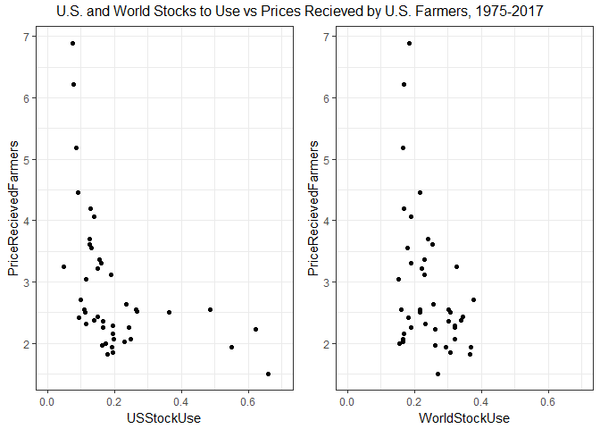
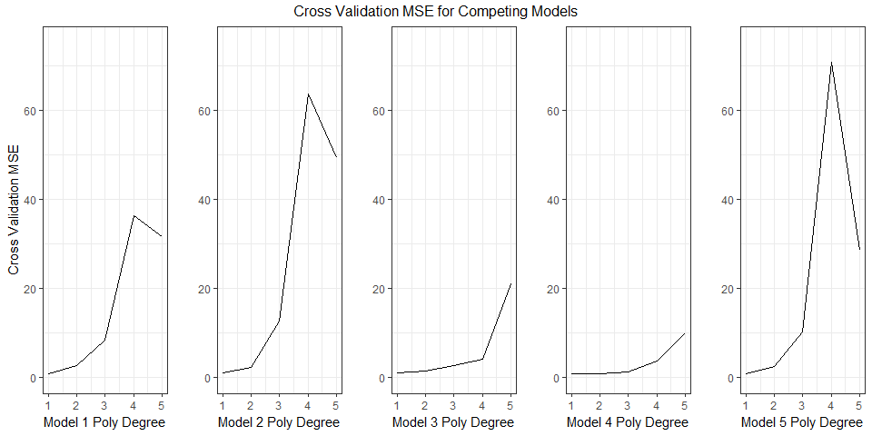

# Machine Learning and Econometrics: Model Selection and Assessment Statistical Learning Style


*This is the second in a series of [posts](http://blog.mindymallory.com/2018/02/how-does-machine-learning-fit-into-agricultural-economics/) where I document my own process in figuring out how machine learning relates to the classic econometrics one learns in a graduate program in economics. Note that I am a humble practitioner of applied econometrics, so the ideas I am working through are not new, or may first take on them might not even be fully correct. But, I think many of us applied economists are starting to learn and dabble in this area and I thought it might be fruitful to community if I learn publicly in these blog posts. These posts are certainly going to solidify my own understanding and serve as helpful notes for my own purposes.* 

I had at least three people reach out after my [first machine learning post](http://blog.mindymallory.com/2018/02/how-does-machine-learning-fit-into-agricultural-economics/) - two in academic positions saying that they are starting to use these methods in their own research and one former classmate in the corporate world who reached out to say these methods are already deeply embedded in their business. Further I saw [\@DrKeIthHCoble](https://twitter.com/DrKeIthHCoble), Ashok Mishra, [\@shanferrell](https://twitter.com/shanferrell), and [\@SpacePlowboy](https://twitter.com/SpacePlowboy) just dropped an AEPP article on the topic, [Big Data in Agriculture: A Challenge for the Future](https://academic.oup.com/aepp/article/40/1/79/4863692). I'm even more convinced now is a really great time to invest in learning this machine learning stuff. This post gets a little wonky, but stay with me. At the end I do an Ag example by fitting models of the relationship between corn prices received by farmers and stocks to use. 

# Flexibility versus Interpretability

I started going through [An Introduction to Statistical Learning](http://www-bcf.usc.edu/~gareth/ISL/index.html), and the first thing that struck me is that linear regression gets two whole chapters devoted to it (Chapters 3 and 6). I was a bit surprised because my naive view was that linear regression was something primitive and completely separate from the concepts of machine learning, whereas in this book, linear regression is presented as a baseline or starting place for the concepts of machine learning. This left me with a question. Why is econometrics as usually presented as something separate methodologically from machine learning? 

In chapter 2, I think I got the answer to my question. The authors note that there is always a tension between flexibility and interpret ability of a model. Linear regression is quite inflexible, but it is readily interpret-able. Non-linear models can be quite complex in how an independent variable is functionally related to the dependent variable. In economics, we care about interpretability. We go through great pains to find instruments, design experiments, get random samples, in order to argue causality of one variable on another. Inference and interpretability matter a great deal to us, so inflexible models are often attractive for this purpose. Additionally, less flexible models often perform fairly well compared to more flexible models in terms of predictive accuracy, at least in out of sample testing, due to the problem of over-fitting in flexible models. So you get a lot of mileage out of an inflexible model like linear regression, and more flexible models might not perform much better on medium data anyway. 

Our analysis is often naturally constrained in terms of the number of independent variables one might include. First, economic theory often suggests what things might be important independent variables, so there is less need to throw everything into a regression and see if it predicts. Or, you might be constrained by the scarcity of relevant data. If you conduct a survey, you can only ask so many questions and then you only have that many potential independent variables. To use a concept from my first machine learning post, we often have 'medium data' not big data. 

I think there are good reasons why econometrics has gravitated to linear regression models as our bread and butter.

Econometrics: 

+ We care very much about inference, less emphasis on prediction $\Rightarrow$ Linear regression often works well
+ We often have medium data $\Rightarrow$ Linear regression often works well. 

So does that mean we should scoff at this statistical learning stuff? No I don't think so. Reading into chapter 5 (Re-sampling Methods) and chapter 6 (Linear Model Selection and Regularization), I think there are really nice opportunities to get a lot of benefit even in a fairly inflexible model and even with medium data. Chapter 5 covers re-sampling methods including Cross-Validation and Bootstrap methods. Bootstrap is ubiquitous in econometrics, but cross-validation could be successfully utilized more, I think. Among those of us working with large 'medium data', like the Census or Ag Census, the methods are chapter 6 are fairly commonly employed, I think. 

Statistical Learning: 

+ More focus on prediction $\Rightarrow$ Larger baseline set of models to choose from. Just so long as it predicts, who cares about causality!
+ Means much more effort exerted at the model selection stage. 

Chapters 2 and 5 discuss the bias-variance trade-off in model selection and the k-Fold cross validation method of model selection, respectively. I briefly summarize these concepts next. 


# Bias-Variance Tradeoff

A key to mastering model assessment and model selection is to understand the bias-variance trade-off. If you have a model, $y = f(x) + \epsilon$, so that $y$ is a function of $f$ plus some noise. Then, if we want to find out how $x$ affects $y$, or use known values of $x$ to predict $y$, we need to find a function $\hat{f}(x)$ that is as close as possible to $f$. The most common way to assess if our $\hat{f}$ is good or not is with mean squared error (MSE), or root mean squared error where we take the square root of the MSE. MSE is defined like this. 

$$MSE = \frac{1}{n}\sum_{i=1}^n (y_i - \hat{f}(x_i))^2 $$

It just takes all the model's predictions, $\hat{f}(x_i)$, calculates the square of how far they are from the actual value, $y_i$, and averages them. So a low MSE is good - your predictions were not far away from the actual values. 

So what contributes to a model's errors? Head over to [Wikipedia](https://en.wikipedia.org/wiki/Bias%E2%80%93variance_tradeoff) for a proof, but for any particular observation the expectation of the terms contributing to the MSE can be broken down as follows, 

$$E(y_i - \hat{f}x_i)^2 = Var(\hat{f}(x_i)) + Bias(\hat{f}(x_i))^2 + Var(\epsilon_i),$$

where, $Bias(\hat{f}(x_i)) = E(\hat{f}(x_i) - f(x_i))$. Clearly to get a low MSE you need a model that will give you low variance and low bias. But, typically these things move in opposite directions. You get a high variance in $\hat{f}$ with a more flexible model because when a model is flexible (think for example of a high degree polynomial versus a linear model where the polynomial has many more parameters to estimate) different training data sets will make the fitted function 'wiggle' around much more than the linear model. Conversely, models that are less flexible have higher bias, because it can not accommodate the true shape of the data generating process as easily as a more flexible model. 

In ISL, figure 2.11 illustrates this very well. 


*This figure is taken from "An Introduction to Statistical Learning, with applications in R" (Springer, 2013) with permission from the authors: G. James, D. Witten,  T. Hastie and R. Tibshirani*

Here you see a scatter-plot of a data set with variables X and Y as circles in the left panel. To model the data they fit a linear model (in gold), and increasingly higher degree polynomials in black, blue, and green. Of course, the higher the degree of the polynomial the more 'wiggly' the $\hat{f}$. Then in the right panel, they plot the MSE of these different candidate $\hat{f}$'s. The training set MSE is in grey and the test set (out of sample in the parlance of price forecasting) MSE is in red. 

This illustrates an important point. Yes, variance and bias of a model move in opposite directions, but not necessarily at the same rate (as flexibility increases I mean). Here, when you move from a linear, to a 3rd degree, to a 5th degree polynomial, you get dramatic reductions in the MSE of both the training set and the test set. 

This is because the reduction in bias as you move away from the linear model overwhelms the increase in variance as you move toward a higher degree polynomial. Though, after about a 5th degree polynomial, the gains disappear and you do not get much more out of adding higher polynomial terms to the $\hat{f}$. So, if this were a model selection exercise in a real research problem, we would probably select a 5th degree polynomial. 

The approach of using MSE for model selection seems to be pretty ubiquitous in machine learning contexts. In economics, it is commonly used to select among competing forecasting models, but I don't think it is used that widely for model selection in models where inference is the goal. 


# Cross Validation

Cross validation is a technique for model selection that I do not believe is widely used by economists, but I think it has a lot of promise. It does not seem to me to require a particularly large data set, so it could be an effective tool even on our 'medium' data sets. 

The idea behind it is pretty simple. At the model selection stage, you will have a number of candidate models. Conceptually, the example above is pretty simple, your candidate models are polynomials of higher and higher degree. But, you could have a number of candidate models that look very different from one another. The MSE approach to model selection is to just see which one predicts the best on a 'hold out' data set. That is basically what we did in the example shown in figure 2.11. 

Cross Validation just takes this one step further. In k-Fold cross validation you do the MSE exercise with k different randomly selected hold out samples for every model you are considering. An illustration for a 5-Fold cross validation sample split is shown in figure 5.5 from the ISL book. 

 


*This figure is taken from "An Introduction to Statistical Learning, with applications in R"  (Springer, 2013) with permission from the authors: G. James, D. Witten,  T. Hastie and R. Tibshirani*


The advantage of this is that it allows the variance and bias of the fitted models to be revealed a little more completely. By using different subsets of your data as the test set you get a sense of how much individual observations are moving around your MSE estimates. When conducting a k-Fold cross validation, you typically just average the MSE's given by each of the k model estimates. 


# An Ag Example

To illustrate the potential of k-Fold cross validation in agricultural economics I will use it in a simple example on a pretty small data set. Every month the USDA puts out the World Agricultural Supply and Demand Estimates (WASDE). This report is followed very closely, especially during the growing season and harvest of commodities important to U.S. agriculture. It publishes what are called 'balance sheets' because they state in a table expectations for supply and demand from various sources for each commodity. 

For store-able  commodities the WASDE also have an estimate of ending stocks, the amount of the grain that is not consumed in the same marketing year it was grown in, and thus carried over to be consumed during the next marketing year. Ending stocks are an important indicator or scarcity or surplus, and thus correlate with prices quite nicely. Rather than simply use ending stocks, a ratio called $Stocks$ $to$ $Use$ has come to be important in price analysis because it allows ending stocks to be expressed in a way that is not influenced by the (potentially growing) size of the market.

$$Stocks \text{  } to \text{  } Use_t = \frac{Ending \text{  } Stocks_t}{Total \text{  } Use_t} $$

Stocks to Use is simply the ratio of ending stocks to the total amount of the commodity 'used'. 

## The Data

Data from historical WASDE reports can be retrieved from the [USDA's Feed Grains Database](https://www.ers.usda.gov/data-products/feed-grains-database/). If you want to follow along, download the .csv file containing ending stocks for corn in the the U.S. and the rest of the world (ROW), as well as average prices received by farmers in the U.S. The following code imports the .csv file (make sure to modify the file path in `read.csv()` to wherever you put the stocks.csv file if you are following along). Then the code creates the stocks to use variable in the line that calls the `mutate()` function.


```r
# If you haven't installed any of the packages listed below, do so with the "install.packages('tibble')" command. 
library(tibble)
library(dplyr)
library(tidyr)
library(ggplot2)
library(knitr)
library(kableExtra)
library(gridExtra)
library(boot)
stocks  <- read.csv('images/stocks.csv')
stocks  <- as_tibble(stocks)
stocks  <- mutate(stocks, USStockUse = USEndingStocks/USTotalUse, WorldStockUse = ROWEndingStocks/WorldTotalUse)

stocks %>% kable(caption = "U.S. and World Ending Stocks, Total Use, Prices Recieved by Farmers, and Stocks to USE, 1975-2017", "html") %>% 
  kable_styling(bootstrap_options = c("striped", "hover"))
```

<table class="table table-striped table-hover" style="margin-left: auto; margin-right: auto;">
<caption>U.S. and World Ending Stocks, Total Use, Prices Recieved by Farmers, and Stocks to USE, 1975-2017</caption>
 <thead>
  <tr>
   <th style="text-align:right;"> Year </th>
   <th style="text-align:right;"> USEndingStocks </th>
   <th style="text-align:right;"> ROWEndingStocks </th>
   <th style="text-align:right;"> USTotalUse </th>
   <th style="text-align:right;"> WorldTotalUse </th>
   <th style="text-align:right;"> PriceRecievedFarmers </th>
   <th style="text-align:right;"> USStockUse </th>
   <th style="text-align:right;"> WorldStockUse </th>
  </tr>
 </thead>
<tbody>
  <tr>
   <td style="text-align:right;"> 1975 </td>
   <td style="text-align:right;"> 633.200 </td>
   <td style="text-align:right;"> 36411 </td>
   <td style="text-align:right;"> 5767.054 </td>
   <td style="text-align:right;"> 228199 </td>
   <td style="text-align:right;"> 2.54 </td>
   <td style="text-align:right;"> 0.1097961 </td>
   <td style="text-align:right;"> 0.1595581 </td>
  </tr>
  <tr>
   <td style="text-align:right;"> 1976 </td>
   <td style="text-align:right;"> 1135.600 </td>
   <td style="text-align:right;"> 39491 </td>
   <td style="text-align:right;"> 5789.200 </td>
   <td style="text-align:right;"> 235034 </td>
   <td style="text-align:right;"> 2.15 </td>
   <td style="text-align:right;"> 0.1961584 </td>
   <td style="text-align:right;"> 0.1680225 </td>
  </tr>
  <tr>
   <td style="text-align:right;"> 1977 </td>
   <td style="text-align:right;"> 1435.900 </td>
   <td style="text-align:right;"> 40833 </td>
   <td style="text-align:right;"> 6207.139 </td>
   <td style="text-align:right;"> 246973 </td>
   <td style="text-align:right;"> 2.02 </td>
   <td style="text-align:right;"> 0.2313304 </td>
   <td style="text-align:right;"> 0.1653339 </td>
  </tr>
  <tr>
   <td style="text-align:right;"> 1978 </td>
   <td style="text-align:right;"> 1709.500 </td>
   <td style="text-align:right;"> 47957 </td>
   <td style="text-align:right;"> 6995.479 </td>
   <td style="text-align:right;"> 254029 </td>
   <td style="text-align:right;"> 2.25 </td>
   <td style="text-align:right;"> 0.2443721 </td>
   <td style="text-align:right;"> 0.1887855 </td>
  </tr>
  <tr>
   <td style="text-align:right;"> 1979 </td>
   <td style="text-align:right;"> 2034.300 </td>
   <td style="text-align:right;"> 59481 </td>
   <td style="text-align:right;"> 7604.060 </td>
   <td style="text-align:right;"> 273641 </td>
   <td style="text-align:right;"> 2.52 </td>
   <td style="text-align:right;"> 0.2675281 </td>
   <td style="text-align:right;"> 0.2173687 </td>
  </tr>
  <tr>
   <td style="text-align:right;"> 1980 </td>
   <td style="text-align:right;"> 1392.100 </td>
   <td style="text-align:right;"> 67180 </td>
   <td style="text-align:right;"> 7282.444 </td>
   <td style="text-align:right;"> 293625 </td>
   <td style="text-align:right;"> 3.11 </td>
   <td style="text-align:right;"> 0.1911584 </td>
   <td style="text-align:right;"> 0.2287952 </td>
  </tr>
  <tr>
   <td style="text-align:right;"> 1981 </td>
   <td style="text-align:right;"> 2536.600 </td>
   <td style="text-align:right;"> 62725 </td>
   <td style="text-align:right;"> 6974.706 </td>
   <td style="text-align:right;"> 290686 </td>
   <td style="text-align:right;"> 2.50 </td>
   <td style="text-align:right;"> 0.3636856 </td>
   <td style="text-align:right;"> 0.2157827 </td>
  </tr>
  <tr>
   <td style="text-align:right;"> 1982 </td>
   <td style="text-align:right;"> 3523.100 </td>
   <td style="text-align:right;"> 60273 </td>
   <td style="text-align:right;"> 7249.090 </td>
   <td style="text-align:right;"> 279377 </td>
   <td style="text-align:right;"> 2.55 </td>
   <td style="text-align:right;"> 0.4860058 </td>
   <td style="text-align:right;"> 0.2157407 </td>
  </tr>
  <tr>
   <td style="text-align:right;"> 1983 </td>
   <td style="text-align:right;"> 1006.300 </td>
   <td style="text-align:right;"> 63421 </td>
   <td style="text-align:right;"> 6692.759 </td>
   <td style="text-align:right;"> 287033 </td>
   <td style="text-align:right;"> 3.21 </td>
   <td style="text-align:right;"> 0.1503565 </td>
   <td style="text-align:right;"> 0.2209537 </td>
  </tr>
  <tr>
   <td style="text-align:right;"> 1984 </td>
   <td style="text-align:right;"> 1648.200 </td>
   <td style="text-align:right;"> 76287 </td>
   <td style="text-align:right;"> 7031.963 </td>
   <td style="text-align:right;"> 297524 </td>
   <td style="text-align:right;"> 2.63 </td>
   <td style="text-align:right;"> 0.2343869 </td>
   <td style="text-align:right;"> 0.2564062 </td>
  </tr>
  <tr>
   <td style="text-align:right;"> 1985 </td>
   <td style="text-align:right;"> 4039.522 </td>
   <td style="text-align:right;"> 75069 </td>
   <td style="text-align:right;"> 6494.029 </td>
   <td style="text-align:right;"> 285517 </td>
   <td style="text-align:right;"> 2.23 </td>
   <td style="text-align:right;"> 0.6220363 </td>
   <td style="text-align:right;"> 0.2629230 </td>
  </tr>
  <tr>
   <td style="text-align:right;"> 1986 </td>
   <td style="text-align:right;"> 4881.693 </td>
   <td style="text-align:right;"> 80862 </td>
   <td style="text-align:right;"> 7385.350 </td>
   <td style="text-align:right;"> 298388 </td>
   <td style="text-align:right;"> 1.50 </td>
   <td style="text-align:right;"> 0.6609968 </td>
   <td style="text-align:right;"> 0.2709962 </td>
  </tr>
  <tr>
   <td style="text-align:right;"> 1987 </td>
   <td style="text-align:right;"> 4259.086 </td>
   <td style="text-align:right;"> 89488 </td>
   <td style="text-align:right;"> 7757.318 </td>
   <td style="text-align:right;"> 304440 </td>
   <td style="text-align:right;"> 1.94 </td>
   <td style="text-align:right;"> 0.5490410 </td>
   <td style="text-align:right;"> 0.2939430 </td>
  </tr>
  <tr>
   <td style="text-align:right;"> 1988 </td>
   <td style="text-align:right;"> 1930.428 </td>
   <td style="text-align:right;"> 96217 </td>
   <td style="text-align:right;"> 7260.121 </td>
   <td style="text-align:right;"> 319881 </td>
   <td style="text-align:right;"> 2.54 </td>
   <td style="text-align:right;"> 0.2658947 </td>
   <td style="text-align:right;"> 0.3007900 </td>
  </tr>
  <tr>
   <td style="text-align:right;"> 1989 </td>
   <td style="text-align:right;"> 1344.457 </td>
   <td style="text-align:right;"> 98715 </td>
   <td style="text-align:right;"> 8119.826 </td>
   <td style="text-align:right;"> 327783 </td>
   <td style="text-align:right;"> 2.36 </td>
   <td style="text-align:right;"> 0.1655771 </td>
   <td style="text-align:right;"> 0.3011596 </td>
  </tr>
  <tr>
   <td style="text-align:right;"> 1990 </td>
   <td style="text-align:right;"> 1521.245 </td>
   <td style="text-align:right;"> 102761 </td>
   <td style="text-align:right;"> 7760.655 </td>
   <td style="text-align:right;"> 319954 </td>
   <td style="text-align:right;"> 2.28 </td>
   <td style="text-align:right;"> 0.1960202 </td>
   <td style="text-align:right;"> 0.3211743 </td>
  </tr>
  <tr>
   <td style="text-align:right;"> 1991 </td>
   <td style="text-align:right;"> 1100.311 </td>
   <td style="text-align:right;"> 113106 </td>
   <td style="text-align:right;"> 7915.336 </td>
   <td style="text-align:right;"> 332232 </td>
   <td style="text-align:right;"> 2.37 </td>
   <td style="text-align:right;"> 0.1390100 </td>
   <td style="text-align:right;"> 0.3404428 </td>
  </tr>
  <tr>
   <td style="text-align:right;"> 1992 </td>
   <td style="text-align:right;"> 2112.981 </td>
   <td style="text-align:right;"> 109068 </td>
   <td style="text-align:right;"> 8471.119 </td>
   <td style="text-align:right;"> 339172 </td>
   <td style="text-align:right;"> 2.07 </td>
   <td style="text-align:right;"> 0.2494335 </td>
   <td style="text-align:right;"> 0.3215714 </td>
  </tr>
  <tr>
   <td style="text-align:right;"> 1993 </td>
   <td style="text-align:right;"> 850.143 </td>
   <td style="text-align:right;"> 107849 </td>
   <td style="text-align:right;"> 7621.383 </td>
   <td style="text-align:right;"> 349304 </td>
   <td style="text-align:right;"> 2.50 </td>
   <td style="text-align:right;"> 0.1115471 </td>
   <td style="text-align:right;"> 0.3087540 </td>
  </tr>
  <tr>
   <td style="text-align:right;"> 1994 </td>
   <td style="text-align:right;"> 1557.840 </td>
   <td style="text-align:right;"> 113777 </td>
   <td style="text-align:right;"> 9352.380 </td>
   <td style="text-align:right;"> 353437 </td>
   <td style="text-align:right;"> 2.26 </td>
   <td style="text-align:right;"> 0.1665715 </td>
   <td style="text-align:right;"> 0.3219159 </td>
  </tr>
  <tr>
   <td style="text-align:right;"> 1995 </td>
   <td style="text-align:right;"> 425.942 </td>
   <td style="text-align:right;"> 122467 </td>
   <td style="text-align:right;"> 8548.436 </td>
   <td style="text-align:right;"> 376204 </td>
   <td style="text-align:right;"> 3.24 </td>
   <td style="text-align:right;"> 0.0498269 </td>
   <td style="text-align:right;"> 0.3255335 </td>
  </tr>
  <tr>
   <td style="text-align:right;"> 1996 </td>
   <td style="text-align:right;"> 883.161 </td>
   <td style="text-align:right;"> 143886 </td>
   <td style="text-align:right;"> 8788.599 </td>
   <td style="text-align:right;"> 382278 </td>
   <td style="text-align:right;"> 2.71 </td>
   <td style="text-align:right;"> 0.1004894 </td>
   <td style="text-align:right;"> 0.3763910 </td>
  </tr>
  <tr>
   <td style="text-align:right;"> 1997 </td>
   <td style="text-align:right;"> 1307.803 </td>
   <td style="text-align:right;"> 133982 </td>
   <td style="text-align:right;"> 8791.000 </td>
   <td style="text-align:right;"> 388191 </td>
   <td style="text-align:right;"> 2.43 </td>
   <td style="text-align:right;"> 0.1487661 </td>
   <td style="text-align:right;"> 0.3451445 </td>
  </tr>
  <tr>
   <td style="text-align:right;"> 1998 </td>
   <td style="text-align:right;"> 1786.977 </td>
   <td style="text-align:right;"> 145972 </td>
   <td style="text-align:right;"> 9298.317 </td>
   <td style="text-align:right;"> 395867 </td>
   <td style="text-align:right;"> 1.94 </td>
   <td style="text-align:right;"> 0.1921828 </td>
   <td style="text-align:right;"> 0.3687400 </td>
  </tr>
  <tr>
   <td style="text-align:right;"> 1999 </td>
   <td style="text-align:right;"> 1717.549 </td>
   <td style="text-align:right;"> 150779 </td>
   <td style="text-align:right;"> 9514.784 </td>
   <td style="text-align:right;"> 412536 </td>
   <td style="text-align:right;"> 1.82 </td>
   <td style="text-align:right;"> 0.1805137 </td>
   <td style="text-align:right;"> 0.3654930 </td>
  </tr>
  <tr>
   <td style="text-align:right;"> 2000 </td>
   <td style="text-align:right;"> 1899.108 </td>
   <td style="text-align:right;"> 126880 </td>
   <td style="text-align:right;"> 9740.316 </td>
   <td style="text-align:right;"> 412710 </td>
   <td style="text-align:right;"> 1.85 </td>
   <td style="text-align:right;"> 0.1949740 </td>
   <td style="text-align:right;"> 0.3074314 </td>
  </tr>
  <tr>
   <td style="text-align:right;"> 2001 </td>
   <td style="text-align:right;"> 1596.426 </td>
   <td style="text-align:right;"> 110808 </td>
   <td style="text-align:right;"> 9815.402 </td>
   <td style="text-align:right;"> 424591 </td>
   <td style="text-align:right;"> 1.97 </td>
   <td style="text-align:right;"> 0.1626450 </td>
   <td style="text-align:right;"> 0.2609759 </td>
  </tr>
  <tr>
   <td style="text-align:right;"> 2002 </td>
   <td style="text-align:right;"> 1086.673 </td>
   <td style="text-align:right;"> 99276 </td>
   <td style="text-align:right;"> 9490.986 </td>
   <td style="text-align:right;"> 427821 </td>
   <td style="text-align:right;"> 2.32 </td>
   <td style="text-align:right;"> 0.1144953 </td>
   <td style="text-align:right;"> 0.2320503 </td>
  </tr>
  <tr>
   <td style="text-align:right;"> 2003 </td>
   <td style="text-align:right;"> 958.091 </td>
   <td style="text-align:right;"> 80334 </td>
   <td style="text-align:right;"> 10229.950 </td>
   <td style="text-align:right;"> 438453 </td>
   <td style="text-align:right;"> 2.42 </td>
   <td style="text-align:right;"> 0.0936555 </td>
   <td style="text-align:right;"> 0.1832215 </td>
  </tr>
  <tr>
   <td style="text-align:right;"> 2004 </td>
   <td style="text-align:right;"> 2113.972 </td>
   <td style="text-align:right;"> 77364 </td>
   <td style="text-align:right;"> 10660.530 </td>
   <td style="text-align:right;"> 465941 </td>
   <td style="text-align:right;"> 2.06 </td>
   <td style="text-align:right;"> 0.1982990 </td>
   <td style="text-align:right;"> 0.1660382 </td>
  </tr>
  <tr>
   <td style="text-align:right;"> 2005 </td>
   <td style="text-align:right;"> 1967.161 </td>
   <td style="text-align:right;"> 73472 </td>
   <td style="text-align:right;"> 11267.804 </td>
   <td style="text-align:right;"> 475772 </td>
   <td style="text-align:right;"> 2.00 </td>
   <td style="text-align:right;"> 0.1745825 </td>
   <td style="text-align:right;"> 0.1544269 </td>
  </tr>
  <tr>
   <td style="text-align:right;"> 2006 </td>
   <td style="text-align:right;"> 1303.647 </td>
   <td style="text-align:right;"> 75639 </td>
   <td style="text-align:right;"> 11206.620 </td>
   <td style="text-align:right;"> 499570 </td>
   <td style="text-align:right;"> 3.04 </td>
   <td style="text-align:right;"> 0.1163283 </td>
   <td style="text-align:right;"> 0.1514082 </td>
  </tr>
  <tr>
   <td style="text-align:right;"> 2007 </td>
   <td style="text-align:right;"> 1624.150 </td>
   <td style="text-align:right;"> 86418 </td>
   <td style="text-align:right;"> 12737.393 </td>
   <td style="text-align:right;"> 515187 </td>
   <td style="text-align:right;"> 4.20 </td>
   <td style="text-align:right;"> 0.1275104 </td>
   <td style="text-align:right;"> 0.1677410 </td>
  </tr>
  <tr>
   <td style="text-align:right;"> 2008 </td>
   <td style="text-align:right;"> 1673.311 </td>
   <td style="text-align:right;"> 100739 </td>
   <td style="text-align:right;"> 12007.572 </td>
   <td style="text-align:right;"> 526638 </td>
   <td style="text-align:right;"> 4.06 </td>
   <td style="text-align:right;"> 0.1393547 </td>
   <td style="text-align:right;"> 0.1912870 </td>
  </tr>
  <tr>
   <td style="text-align:right;"> 2009 </td>
   <td style="text-align:right;"> 1707.787 </td>
   <td style="text-align:right;"> 97474 </td>
   <td style="text-align:right;"> 13041.023 </td>
   <td style="text-align:right;"> 546250 </td>
   <td style="text-align:right;"> 3.55 </td>
   <td style="text-align:right;"> 0.1309550 </td>
   <td style="text-align:right;"> 0.1784421 </td>
  </tr>
  <tr>
   <td style="text-align:right;"> 2010 </td>
   <td style="text-align:right;"> 1127.645 </td>
   <td style="text-align:right;"> 93924 </td>
   <td style="text-align:right;"> 13033.141 </td>
   <td style="text-align:right;"> 570041 </td>
   <td style="text-align:right;"> 5.18 </td>
   <td style="text-align:right;"> 0.0865214 </td>
   <td style="text-align:right;"> 0.1647671 </td>
  </tr>
  <tr>
   <td style="text-align:right;"> 2011 </td>
   <td style="text-align:right;"> 989.027 </td>
   <td style="text-align:right;"> 103071 </td>
   <td style="text-align:right;"> 12481.947 </td>
   <td style="text-align:right;"> 607875 </td>
   <td style="text-align:right;"> 6.22 </td>
   <td style="text-align:right;"> 0.0792366 </td>
   <td style="text-align:right;"> 0.1695595 </td>
  </tr>
  <tr>
   <td style="text-align:right;"> 2012 </td>
   <td style="text-align:right;"> 821.185 </td>
   <td style="text-align:right;"> 112089 </td>
   <td style="text-align:right;"> 11082.899 </td>
   <td style="text-align:right;"> 606563 </td>
   <td style="text-align:right;"> 6.89 </td>
   <td style="text-align:right;"> 0.0740948 </td>
   <td style="text-align:right;"> 0.1847937 </td>
  </tr>
  <tr>
   <td style="text-align:right;"> 2013 </td>
   <td style="text-align:right;"> 1231.904 </td>
   <td style="text-align:right;"> 142987 </td>
   <td style="text-align:right;"> 13454.039 </td>
   <td style="text-align:right;"> 661861 </td>
   <td style="text-align:right;"> 4.46 </td>
   <td style="text-align:right;"> 0.0915639 </td>
   <td style="text-align:right;"> 0.2160378 </td>
  </tr>
  <tr>
   <td style="text-align:right;"> 2014 </td>
   <td style="text-align:right;"> 1731.164 </td>
   <td style="text-align:right;"> 165766 </td>
   <td style="text-align:right;"> 13747.918 </td>
   <td style="text-align:right;"> 686099 </td>
   <td style="text-align:right;"> 3.70 </td>
   <td style="text-align:right;"> 0.1259219 </td>
   <td style="text-align:right;"> 0.2416065 </td>
  </tr>
  <tr>
   <td style="text-align:right;"> 2015 </td>
   <td style="text-align:right;"> 1737.058 </td>
   <td style="text-align:right;"> 170837 </td>
   <td style="text-align:right;"> 13663.635 </td>
   <td style="text-align:right;"> 669447 </td>
   <td style="text-align:right;"> 3.61 </td>
   <td style="text-align:right;"> 0.1271300 </td>
   <td style="text-align:right;"> 0.2551912 </td>
  </tr>
  <tr>
   <td style="text-align:right;"> 2016 </td>
   <td style="text-align:right;"> 2293.303 </td>
   <td style="text-align:right;"> 171509 </td>
   <td style="text-align:right;"> 14648.801 </td>
   <td style="text-align:right;"> 747315 </td>
   <td style="text-align:right;"> 3.36 </td>
   <td style="text-align:right;"> 0.1565523 </td>
   <td style="text-align:right;"> 0.2295003 </td>
  </tr>
  <tr>
   <td style="text-align:right;"> 2017 </td>
   <td style="text-align:right;"> 2352.370 </td>
   <td style="text-align:right;"> 143333 </td>
   <td style="text-align:right;"> 14595.000 </td>
   <td style="text-align:right;"> 749749 </td>
   <td style="text-align:right;"> 3.30 </td>
   <td style="text-align:right;"> 0.1611764 </td>
   <td style="text-align:right;"> 0.1911746 </td>
  </tr>
</tbody>
</table>
Source: [USDA Feedgrains Database](https://www.ers.usda.gov/data-products/feed-grains-database/)


This is clearly not big data if I can print the whole data set right in the blog post! We have 43 years of data. Note that the 2017 observation is an expectation. We are not sure what carryout for the 2017 marketing year will be. The U.S. ending stocks and total use are in millions of bushels. The World ending stocks and total use are in 1,000 MT. 
 
Now lets just plot the U.S. and World stocks to use versus price to get a sense of what the relationship looks like. 


```r
us      <- ggplot(stocks, aes(x = USStockUse, y = PriceRecievedFarmers)) + geom_point() + theme_bw() + xlim(0, .7)

ROW      <- ggplot(stocks, aes(x = WorldStockUse, y = PriceRecievedFarmers)) + geom_point() + theme_bw()  + xlim(0, .7)

grid.arrange(us, ROW, nrow = 1, top = "U.S. and World Stocks to Use vs Prices Recieved by U.S. Farmers, 1975-2017")
```

<!-- -->


In the U.S. panel, a clear non-linear relationship if evident. The points from 2010-2012 had low stocks to use and exceptionally high prices. The points with the highest stocks to use and lowest prices are from the 1980's when the U.S. government was in the business of holding stocks to support prices. Despite the non-linearity, there is clearly a relationship between stocks to use and prices for corn, as we would expect. 

In a [farmdoc Daily article](http://farmdocdaily.illinois.edu/2015/04/relationship-stock-to-use-and-corn-prices.html) Darrel Good and Scott Irwin propose,

$$Price = \alpha + \beta \frac{1}{Stocks \text{  } to \text{  } Use} + \epsilon,$$

as a model for 'predicting' the average price received by farmers variable. This certainly seems like a sensible choice, given that the shape of the relationship resembles $y = \frac{1}{x}$, but in this example, we will see if we can find another functional form that performs better in terms of cross validation MSE. We will also consider if the log of the stocks to use variable might fit, since this could also produce close to the correct curved shape (with a negative coefficient of course). I should note that in the farmdoc daily article, Good and Irwin use a much shorter sample that possibly reflects more closely current supply and demand dynamics better. But, in our case, we need the sample size to do the more data intensive cross validation. 

We will use a 5-Fold cross validation to assess the models. Since World Stocks to Use might give additional predictive power, we will work it into some of our specifications. We will consider each of the following model types, and we will try them with the polynomial terms with degree from 1 to 5: 

|Model         | Functional Form | 
|:----------------------|:----------------------------------------------------------------------------------------|
|Model 1       | $Price = \beta_0 + \sum_{i=1}^n \beta_i \Big(\frac{1}{US \text{ } Stocks \text{ } to \text{ } Use} \Big)^i + \epsilon$         |
|Model 2       | $Price = \beta_0 + \sum_{i=1}^n \beta_i \Big(\frac{1}{US \text{ } Stocks \text{ } to \text{ } Use} \Big)^i + \sum_{i=1}^n \gamma_i \Big(\frac{1}{World \text{ } Stocks \text{ } to \text{ } Use} \Big)^i + \epsilon$         |
|Model 3       | $Price = \beta_0 + \sum_{i=1}^n \beta_i \Big(log(US \text{ } Stocks \text{ } to \text{ } Use \Big)^i + \epsilon$         |
|Model 4       | $Price = \beta_0 + \sum_{i=1}^n \beta_i \Big(log(US \text{ } Stocks \text{ } to \text{ } Use \Big)^i + \sum_{i=1}^n \gamma_i \Big(log(World \text{ } Stocks \text{ } to \text{ } Use \Big)^i + \epsilon$         |
|Model 5       | $Price = \beta_0 + \sum_{i=1}^n \beta_i \Big(\frac{1}{US \text{ } Stocks \text{ } to \text{ } Use} \Big)^i + \sum_{i=1}^n \gamma_i \Big(log(World \text{ } Stocks \text{ } to \text{ } Use \Big)^i + \epsilon$         |


In the code below, each for loop is fitting one of the models 1-5 and looping over the polynomial degree. So in total, we have fit 25 different models. In addition to that the line with the `cv.glm()` function is performing the k-Fold cross validation, i.e. generating 5 test and hold out samples, calculating the MSE of each and then averaging it. The `cv.XXXX` vectors are storing the cross validation MSE to plot and display below. 


```r
set.seed(17)
cv.us=rep(0,5)
cv.World=rep(0,5)
cv.Lus=rep(0,5)
cv.LWorld=rep(0,5)
cv.World2=rep(0,5)
for (i in 1:5){
    glm.fit=glm(PriceRecievedFarmers~poly(1/USStockUse, i) ,data=stocks)
    cv.us[i]=cv.glm(stocks,glm.fit,K=5)$delta[1]
}

for (i in 1:5){
  glm.fit.World=glm(PriceRecievedFarmers~poly(1/USStockUse, i) + poly(1/WorldStockUse, i) ,data=stocks)
  cv.World[i]=cv.glm(stocks,glm.fit.World,K=5)$delta[1]
}

for (i in 1:5){
    glm.fit=glm(PriceRecievedFarmers~poly(log(USStockUse), i) ,data=stocks)
    cv.Lus[i]=cv.glm(stocks,glm.fit,K=5)$delta[1]
}

for (i in 1:5){
  glm.fit.World=glm(PriceRecievedFarmers~poly(log(USStockUse), i) + poly(log(WorldStockUse), i),data=stocks)
  cv.LWorld[i]=cv.glm(stocks,glm.fit.World,K=5)$delta[1]
}

for (i in 1:5){
  glm.fit.World=glm(PriceRecievedFarmers~poly(1/USStockUse, i) + poly(log(WorldStockUse), i),data=stocks)
  cv.World2[i]=cv.glm(stocks,glm.fit.World,K=5)$delta[1]
}

res_tibble        <- cbind(cv.us, cv.World, cv.Lus, cv.LWorld, cv.World2) %>% as_tibble() %>% add_column(PolynomialDegree = seq(1:5)) %>% round(2)

colnames(res_tibble) <- c('Model 1', 'Model 2', 'Model 3', 'Model 4', 'Model 5', 'PolynomialDegree')

p1 <- ggplot(res_tibble, aes(x = PolynomialDegree, y = cv.us)) + geom_line() + ylim(0, 75) +  labs(x = 'Model 1 Poly Degree', y = 'Cross Validation MSE') + theme_bw()  
p2 <- ggplot(res_tibble, aes(x = PolynomialDegree, y = cv.World)) + geom_line() + ylim(0, 75) + labs(x = 'Model 2 Poly Degree', y = '') + theme_bw()
p3 <- ggplot(res_tibble, aes(x = PolynomialDegree, y = cv.Lus)) + geom_line() + ylim(0, 75) + labs(x = 'Model 3 Poly Degree', y = '') + theme_bw()
p4 <- ggplot(res_tibble, aes(x = PolynomialDegree, y = cv.LWorld)) + geom_line() + ylim(0, 75) + labs(x = 'Model 4 Poly Degree', y = '') + theme_bw()
p5 <- ggplot(res_tibble, aes(x = PolynomialDegree, y = cv.World2)) + geom_line() + ylim(0, 75) + labs(x = 'Model 5 Poly Degree', y = '') + theme_bw()
grid.arrange(p1, p2, p3, p4, p5, nrow = 1, top = "Cross Validation MSE for Competing Models")
```

<!-- -->

The figure shows the cross validation MSE we get from each of the five models fit with polynomial degree 1:5. Remember, to get the cross validation MSE the `cv.glm()` function with `k = 5` is creating 5 different non-overlapping test and hold out samples. The MSE plotted in the figure is average of the MSE from each of the 5 different hold out samples. 

In the table below we present the same information, the cross validation MSE by model type and for each polynomial degree. Since there were several models with very similar MSE we can see exactly which models are getting the minimum MSE. 

Recall that Model 1 with a 1 degree polynomial is the model proposed by Good and Irwin in the farmdoc Daily article. This model does quite well, it comes in third, and the models that do better only do marginally better. The first place model is Model 5 with polynomial degree 1; the second place model is Model 4 with polynomial degree 2. 

Now to get a sense of whether or not these models are providing economically different predictions, we show predictions from the top three models in the table below. 


|Rank                |  Specification                         | 2017 Price|
|:----------------------|:-----------------------------------------------------------|:-------------------------------------------|
| 1      |$Price = \beta_0 + \beta_1 \frac{1}{US \text{ } Stocks \text{ } to \text{ } Use} + \gamma_1 log(World \text{ } Stocks \text{ } to \text{ } Use) + \epsilon$ |3.06  |
| 2        | $Price = \beta_0 + \sum_{i=1}^2 \beta_i \Big(log(US \text{ } Stocks \text{ } to \text{ } Use \Big)^i + \sum_{i=1}^2 \gamma_i \Big(log(World \text{ } Stocks \text{ } to \text{ } Use \Big)^i + \epsilon$   |3.15  |
| 3        | $Price = \beta_0 + \beta_1 \frac{1}{US \text{ } Stocks \text{ } to \text{ } Use} + \epsilon$ | 2.77  |


Currently, the March 2018 futures contract is trading at around \$3.65, which is significantly higher than each of these predictions, but if you look back at the scatter-plot of the actual data, \$3.65 is well within the typical variability for a stocks to use value of 0.16 which is our current expectation for the 2017/18 marketing year. 


# That's It!

That's it for this time! I hope you enjoyed this explanation and toy example of cross validation. I certainly learned a lot writing it! I think you would only consider using cross validation for model selection if your data set was at least modestly bigger that the one in this post. However, this example goes to show that the technique can be useful even in medium data! 

In the next post I will talk about Tree-Based Methods, Random Forests, Boosting, and Bagging from chapter 8 of ISL. I really currently know zero about these methods, but I have heard a lot of buzz about them. It is my sense that these are 'real' machine learning topics, whereas the cross validation and model selection stuff is more like necessary background. 

Stay Tuned!


