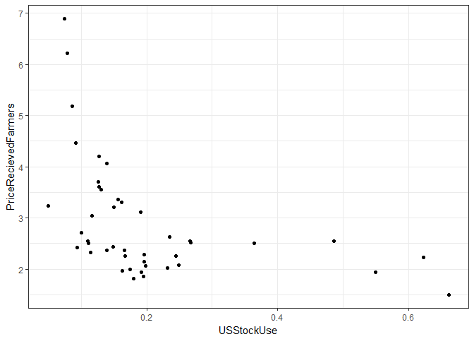
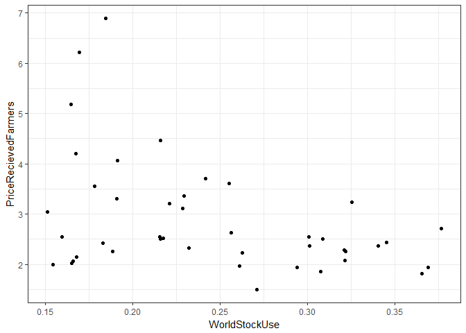

# Machine Learning and Econometrics: Flexibilty versus Interpretability


*This is the second in a series of posts where I document my own process in figuring out how machine learning relates to the classic econometrics one learns in a graduate program in economics. Note that I am a B+ practitioner of applied econometrics, so the ideas I am working through are not new, or may not even be fully accurate. But, I think many of us applied economists are starting to learn and dabble in this area and I thought it might be fruitful to learn publicly in these blog posts.* 

I had at least three people reach out after my first machine learning post saying that they are starting to use these methods in their own research, and one former classmate in the corporate world who reached out to say these methods are already deeply embeded in their business. It feels like this is a really great time to sort these things out. 

# Flexibility versus Interpretability

I started going through [An Introduction to Statistical Learning](http://www-bcf.usc.edu/~gareth/ISL/index.html), and the first thing that struck me is that linear regression gets two whole chapters devoted to it (Chapters 3 and 6). I was a bit surprised because my niave view was that linear regression was something primitive and completely separate from the concepts of machine learning, wheras in this book, linear regression is presented as a baseline or starting place for the concepts of machine learning. This left me with a question. Why is econometrics as usually presented as something separate methodologically from machine learning? 

In chapter 2, I think I got the answer to my question. The authors note that there is always a tension between flexibility and interpretability of a model. Linear regression is quite inflexible, but it is readily interpretable. Non-linear models can be quite complex in how an independent variable is functionally related to the dependent variable. In economics, we care about interpretability. We go through great pains to find instruments, design experiments, get random samples, in order to argue causaility of one variable on another. Inference and interpretability matter a great deal to us, so inflexible models are often attractive for this purpose. Additionally, less flexible models often perform fairly well compared to more flexible models in terms of predictive accuracy, at least in out of sample testing, due to overfitting in flexible models. So you get a lot of milage out of an inflexible model like linear regression, and more flexible models might not perform much better on meduim data anyway. 

Our analysis is often naturally constrained in terms of the number of independent variables one might include. First, economic theory often suggests what things might be important independent variables, so there is less need to throw everything into a regression and see if it predicts. Or, you might be constrained by the scarcity of relevent data. If you conduct a survey, you can only ask so many questions and then you only have that many potential independent varaibles. To use a concept from my first machine learning post, we often have 'medium data' not big data. 

So I think there are good reasons why econometrics has gravatated to linear regression models.

+ We care very much about inference, less emphasis on prediction $\Rightarrow$ Linear regression often works well
+ We often have medium data $\Rightarrow$ Linear regression often works well. 

So does that mean we should scoff at this machine learning stuff? No I don't think so. Reading into chapter 5 (Resampling Methods) and chapter 6 (Linear Model Selection and Regularization), I think there are really nice opportunities to get a lot of benefit even in a linear model and even with medium data. Chapter 5 covers resampling methods including Cross-Validation and Bootstrap methods. Bootstrap is ubiquitous in econometrics, but cross-validation could be successfully utilized more, I think. Among those of us working with large 'medium data', like the Census or Ag Census, the methods are chapter 6 are fairly commonly employed, I think. 

I'll explore concepts called bias-variance tradeoff and cross validation a little more in the remainder of this post. 

# Bias-Variance Tradeoff


# Cross Validation

The k-Fold Cross-Validation is a method to 


*This figure is taken from "An Introduction to Statistical Learning, with applications in R"  (Springer, 2013) with permission from the authors: G. James, D. Witten,  T. Hastie and R. Tibshirani*


# An Ag Example

Ending Stocks. U.S. Million bushels. Row, 1000 MT. 


```r
# install.packages('tibble')
library(tibble)
library(dplyr)
library(tidyr)
library(ggplot2)
stocks  <- read.csv('images/stocks.csv')
stocks  <- as_tibble(stocks)
stocks  <- mutate(stocks, USStockUse = USEndingStocks/USTotalUse, WorldStockUse = ROWEndingStocks/WorldTotalUse)

us      <- ggplot(stocks, aes(x = USStockUse, y = PriceRecievedFarmers)) + geom_point() + theme_bw()
us
```

<!-- -->

```r
ROW      <- ggplot(stocks, aes(x = WorldStockUse, y = PriceRecievedFarmers)) + geom_point() + theme_bw()
ROW
```

<!-- -->
